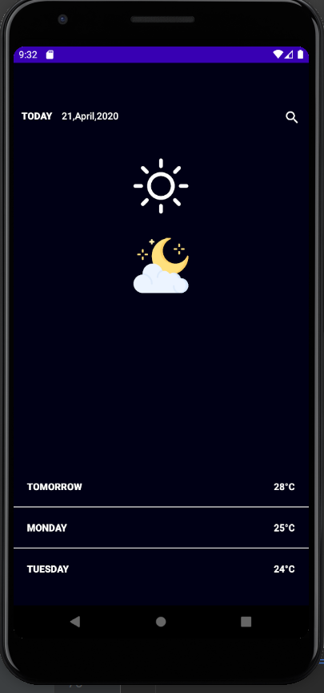

## Weather App Concept
Weather app concept is a simple demonstration of building UIs using [Jetpack Compose](https://developer.android.com/jetpack/compose) which is a declarative way of building Android
app UIs using the power of [Kotlin](https://kotlinlang.org). It is currently in alpha at the time of this publishing and it is a good time to lean compose.


Here is a screenshot of the complete UI




### Set Up
- Get a copy of [Android studio canary](https://developer.android.com/studio/preview) since compose is still in alpha

## Hello World

A hello world project is very simple. AL, required is a simple function annotated with  @Compaosable

```kotlin

@Composable
fun HelloAndroid() {
  Text(text = "Hello, Android")
}

```
### Useful Materials
[Jetpack Compose tutorial](https://developer.android.com/jetpack/compose/tutorial)

[Jetpack Compose Pathway](https://developer.android.com/courses/pathways/compose)

[Documentation](https://developer.android.com/jetpack/compose/documentation)

[Become a Composer](https://www.droidcon.com/media-detail?video=412304809)


